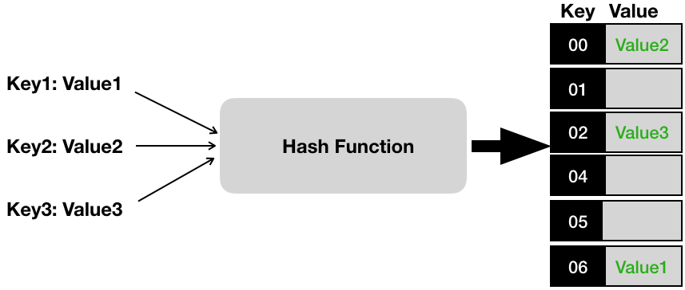
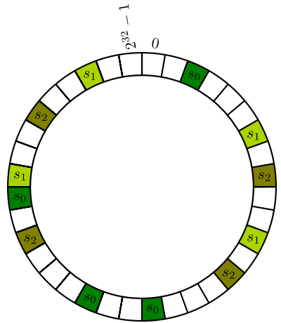

# Consistent Hashing

## Hashing
* *Hash*: Take an item as input and get back another stored item. 
  * URL input : Server as output where the page is hosted. Or based on request ID determine which server should handle the request. 
  * The data structure used is called HashTable and given the input, process of getting the output is called Hashing.
  * Hashing takes a key and generates a large number to represent memory address (bucket) and since we have limited space we use the 
technique `(hash mod N)` That bucket would give us the address of the server or the value to be used.
``` hash(input) mod N  ## N is total number of memory locations/possible buckets ```


**Addition/Deletion of Buckets:** Problem with this approach is that ordinary hash table relies on presence of fixed, 
constant number of locations but in real environments we see nodes getting removed and added frequently. In order for this scheme to work 
we would need to move around lot of data when nodes get added/deleted which proves to be a bottleneck for scalability. 
e.g this situation occurs frequently in Content Delivery Networks , which copy websites across multiple servers and need to know
 which server to return when asked for a particular URL. Servers die and sometimes more server gets added, number of server changes all the time. 

## Consistent Hashing

##### How it works
* Output of a hash function is treated as a fixed circular ring (largest hash wraps around to smallest hash values).
* One location house multiple values from multiple keys.
* Don't number your locations consecutively, randomly assign numbers between 0 to some limit. For server example, these locations would store multiple server addresses for URLs.
* Instead of doing hash(input) mod N, find the smallest location number greater than your key's hash and put it there for the insertion or 
get the value from that location for lookup.
* Each node is responsible for the region in the ring between it and its predecessor node on the ring.



#### Advantage
* Arrival or deletion of a node only affects its immediate neighbors as the load now is handled by them
* No need to do a total rebalancing.

##### Challenges
* Random assignment might(would) lead to non-uniform distribution of load/data.
  * Solution is virtual nodes i.e. each node is assigned multiple positions in the ring.
* Algo is oblivious to the performance/heterogeniety of the nodes.
  * Number of virtual nodes can be decided based on capacity of the nodes.

