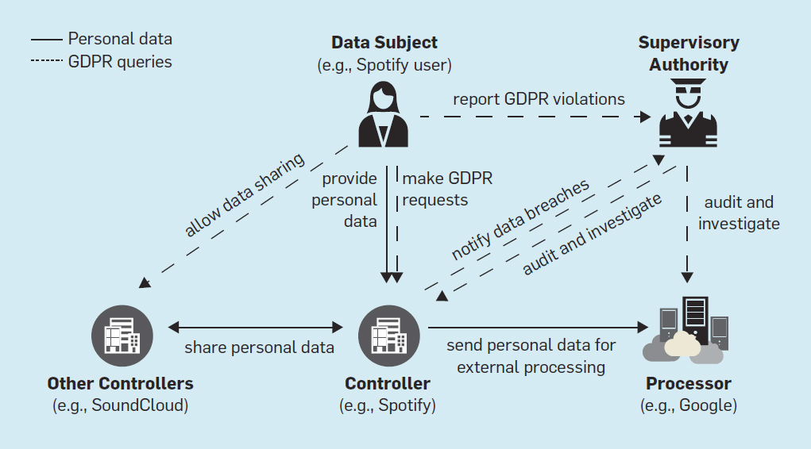
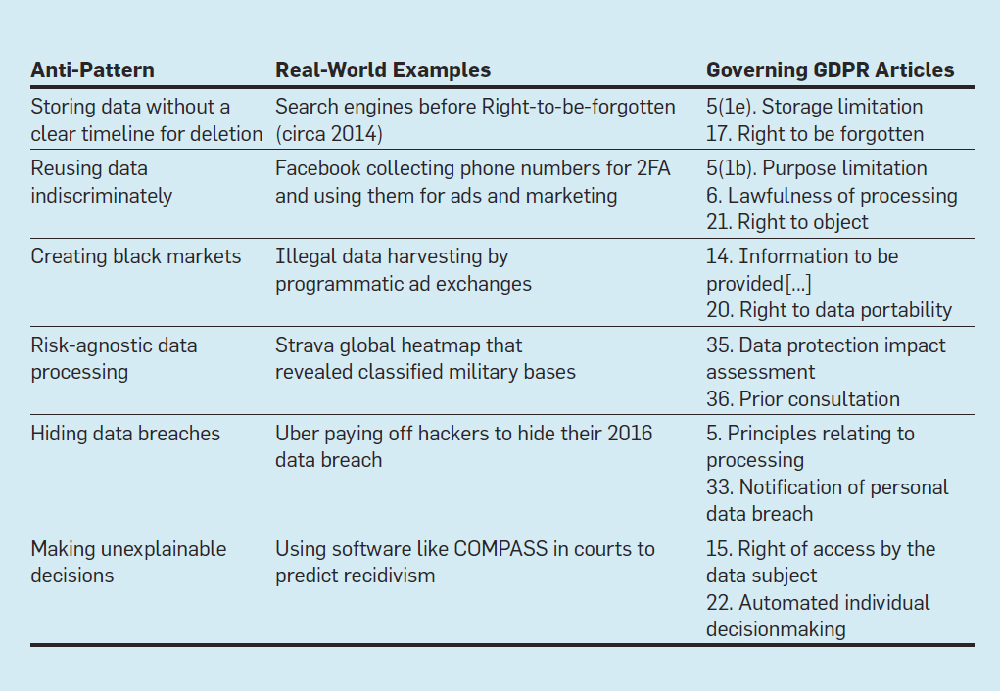

### GDPR
General Data Protection Regulation is a European privacy law introduced to offer new rights and protections to people concerning their personal data. It was rolled on May 25, 2018.
It was enacted to prevent a widespread and systematic abuse of personal data.

**Data Subject** -> The person whose personal data is collected. 
**Data Controller** -> Entity that collects and uses personal data. 
**Data Processor** -> Entity that processes perrsonal data on behalf of the controller. 

GDPR grants new rights to customers and assigns responsibilities to controllers and processors. 
- A person can request a controller to grant access to all of their personal data, to rectify errors, to request deletion, to object to their data being used for specific purposes and to port their data to third parties and so on.
- Controller is required to obtain people's consent before using their personal data, to notify them of data breaches within 72 hours, to design system that are secure and to maintain records of activities performed on personal data.

#### GDPR Anti Patterns
It refers to system designs and operational practices which are effective in their own context, but violate the rights and regulations of GDPR. 

1. **Storing Data without a clear timeline for deletion** 
**_Right to be forgotten_** -> controller should allow the erasure of personal data without undue delay  
**_Information to be provided where personal data are collected from data subject_** -> controller should provide the period for which personal data will be stored. 
**_Storage Limitation_** -> should not be kept longer than necessary. 
Since all the big companies focus on performance, reliability, scalability etc. privacy and security are on backseat. Deletion is not a one step process and it takes some amount of processing and data for these giants to delete the data. This is because, for performance, reliability, and scalability reasons, parts of data get replicated in various storage subsystems like memory, cache, disks, tapes, and network storage; multiple copies of data are saved in redundant backups and geographically distributed datacenters. 

2. **Reusing data indiscriminately** 
Data was supposed to be helper tool/resource that serves these high level entities acheive their goals. But now companies collect the data once and use it for multiple purposes/services. 
**_Purpose Limitation_** -> Personal data shall be collected for specified, explicit and legitimate purposes and not futher processes in a manner that is incompatible with those purposes. 
**_Lawfulness of processsing_** -> Processing should be lawful only if the data subject has given consent.  
**_Right to Object_** -> data subject shall have the right to object, at any time to processing of personal data concerning him or her. 

3. **Walled gardens and Black Market** 
As we are in early days of large scale commoditization of personal data, norms of acquiring, sharing, processing and reselling them are not yet well established. 
**_Right to data portability_** -> data subject shall have the right to receive data concerning him or her, which is collected by the contrroller. Also right to have personal data transmitted directly from one controller to another. 
**_Info to be provided where personal data have not been obtained from data subject_** -> a) purpose of processing b) recipients, c) period for which it will be stored d) frrom which source personal data originate e) it should be provided within a month  
4. **Risk-agnostic data processing** 
Modern technology companies face the challenge of creating and managing increasingly complex software systems in an environment that demands rapid innovation. This has led to a practice, especially in the Internet-era companies, of prioritizing speed over correctness.  
**_Data protection impact assessment_** -> Where processing, in particular using new technologies, ... is likely to result in a high risk to the rights and freedoms of natural persons, the controller shall, prior to the processing, carry out an assessment of the impact of the envisaged processing operations on the protection of personal data  
**_Prior consultation_** -> the controller shall consult the supervisory authority prior to processing where, that would result in a high risk in the absence of measures taken by the controller to mitigate the risk. 

5. **Hiding Data breaches** 
**_Principles relating to processing_** -> personal data shall be processed with lawfulness, fairrness and transparency. Purpose Limitation, data minimization; accurracy; storage limitation; integrity and confidentiality. Controller shall be responsible for, and be able to, demonstrate compliance. 
**_Notification of personal data breach_** -> user shall be notified within 72 hours once controller becomes aware of it 

6. **Making unexplainable decisions** 
Algorithmic decision-making has been successfully applied to several domains: curating media content, managing industrial operations, trading financial instruments, personalizing advertisements, and even combating fake news.  
**_Automated individual decision making_** -> Data subject shall have the right not to be subject to a decision based solely on automated processing. 
**_Right of access by data subject_** -> The data subject shall have the right to obtain from the controller ... meaningful information about the logic involved, as well as the significance and the envisaged consequences of such processing. 
"right to explanation" and thus, human interpretability should be a design consideration for machine learning and artificial intelligence systems.  

