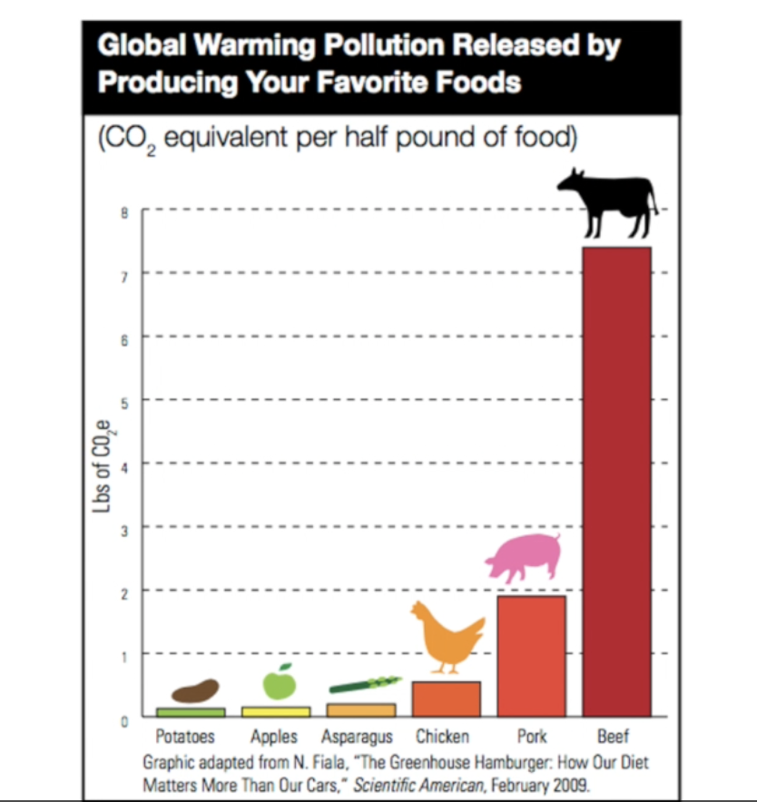

## Sustainable Eating

### What is sustainable Eating ?
The way food is produced impacts environment. Today we consume more resources than the earth is producing. Upto 1/3 of all emissions that contribute to global
warming comes from our food systems. Concept of sustainability encompasses goals of producing healthful foods without compromising ability of future 
generations to do so.
- Sustainable Farming
- Sustainable Eating (More green/plants)

#### Polution caused by Meat Sources
       

#### Healthy Plate and 4 steps to eat green
1. Eat more plants
2. Eat less meat, especially beef.
3. Buy local, in-season, organic
4. Reduce waste

      

### Steps to a more sustainable Diet
- Learn why to eat sustainably
- Learn how to shop sustainably
- Cook sustainaly at home
- Ask before you buy
- Eat seasonably
- Grow your own
- Eat less meat
- Share what you know

Quote of the week: “Nothing will benefit human health and increase chances for survival of life on Earth as much as the evolution to a vegetarian [plant based] diet.” -- Albert Einstein

